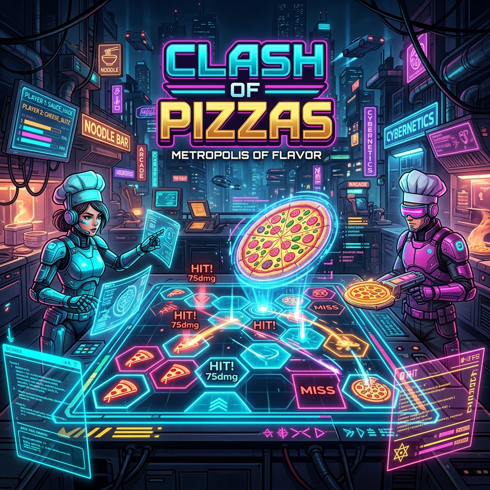
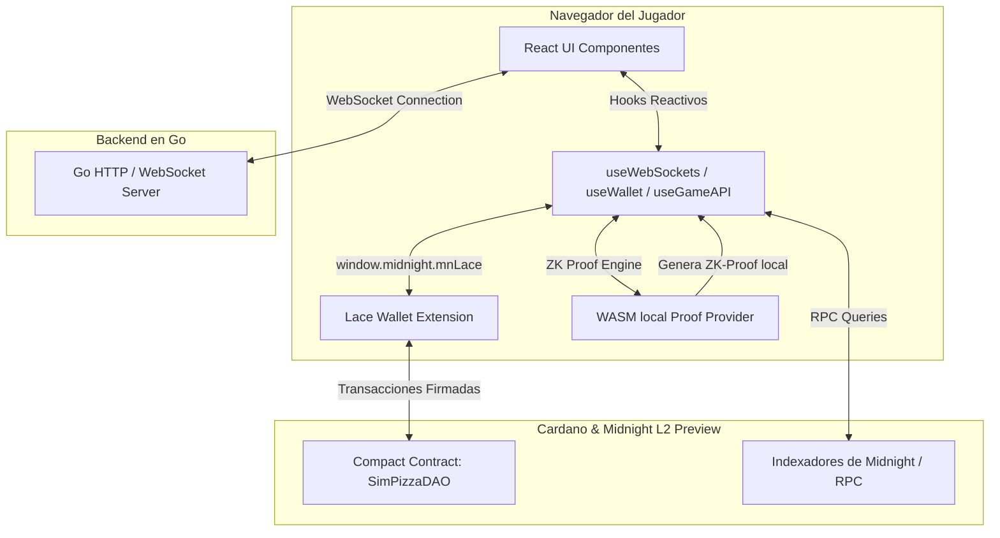

# Clash of Pizzas: Metropolis of Flavor 🏙️🍕🌶️🏆🛡️



**Clash of Pizzas: Metropolis of Flavor** es un juego multijugador competitivo en tiempo real de estrategia y combate por celdas, inspirado en el clásico acorazado (battleship). Combina un backend de alto rendimiento en **Go**, una interfaz interactiva moderna en **React** y el protocolo de privacidad L2 de **Midnight (Cardano)** para proveer jugadas ocultas y combate criptográficamente honesto.

El juego está diseñado para jugarse de forma descentralizada y a escala global, asegurando que ningún jugador pueda hacer trampa alterando su tablero a mitad del duelo mediante el patrón **Commit-Reveal** y pruebas **Zero-Knowledge (ZK)** generadas en el navegador del cliente.

---

## 🏗️ Resumen de la Arquitectura del Sistema

La dApp sigue una arquitectura híbrida de alto rendimiento y bajo costo, diseñada para mitigar latencias y eliminar costos de servidores innecesarios en producción:



1. **Frontend (React + Vite):** Interface cyberpunk neón. Realiza las llamadas ZK localmente en el navegador compilando el testigo (witness) a WebAssembly (WASM) para un costo cero de hosting en Vercel.
2. **Backend (Go):** Gestiona la concurrencia masiva, el emparejamiento rápido de duelos en memoria (Matchmaker) y retransmite jugadas por WebSockets de forma optimista con 0ms de lag de control.
3. **Ledger L2 (Midnight Preview):** Almacena los hashes de compromiso y procesa el reclamo de recompensas on-chain mediante Lace Wallet.

---

## 🔒 Privacidad ZK: ¿Qué es Público y qué es Privado (Shielded)?

Para asegurar la jugabilidad sin revelar información sensible, el contrato inteligente escrito en **Compact** de Midnight divide estrictamente los estados:

### 🛡️ Estado Privado (Shielded / Solo Cliente)
Estos datos pertenecen al jugador y nunca se envían de forma legible a la blockchain ni al backend del servidor:
* **Diseño del Tablero (Pizzas, Trampas, Curas):** La ubicación exacta de las Margherita, Pepperoni, Habaneros y Trufas de Oro del jugador se mantiene localmente en el navegador y se almacena cifrada en `localStorage` mediante el `PrivateStateProvider`.
* **Salts Criptográficos:** Claves de aleatoriedad generadas localmente para blindar los hashes contra ataques de fuerza bruta.

### 🌐 Estado Público (On-Chain / Visible en el Ledger)
Estos datos se registran en la blockchain y son verificados criptográficamente mediante ZK-proofs:
* **Compromisos de Tablero (`public_p1_commitment`, `public_p2_commitment`):** El hash Merkle Root del diseño del tablero privado y el salt. Una vez publicado en `initialize_game`, el jugador no puede mover sus piezas sin romper el hash.
* **Vida del Chef (`public_p1_hp`, `public_p2_hp`):** El estado de vida visible necesario para que la lógica de fin de partida sea verificable por cualquiera.
* **Puntuación (`public_p1_score`, `public_p2_score`):** Los puntos acumulados al morder pizzas del rival.
* **Estado de Revelado y Validez:** Banderas que indican si un jugador ya develó su tablero final y si este cumplía las reglas (ej. no llenar la mesa de curas).

---

## ⚔️ El Patrón Commit-Reveal para Prevención de Trampas

Battleship tiene una vulnerabilidad clásica: un jugador deshonesto puede cambiar la posición de su barco justo antes de recibir un impacto para simular un fallo. Clash of Pizzas resuelve esto implementando el patrón **Commit-Reveal** de dos fases:

1. **Fase 1: Compromiso (Commit):** Antes de iniciar los turnos, cada cliente genera un hash de su tablero + salt local:
   $$\text{Commitment} = \text{Hash}(\text{Board} \parallel \text{Salt})$$
   Este hash se publica on-chain. El tablero privado se bloquea.
2. **Fase 2: Prueba del Mordisco:** En cada turno, cuando el rival muerde, el defensor genera una prueba ZK local en WASM demostrando:
   $$\text{ZK-Proof} \vdash \text{Hash}(\text{PrivateBoard} \parallel \text{Salt}) == \text{Commitment} \quad \land \quad \text{PrivateBoard}[\text{Index}] == \text{CellValue}$$
   El contrato inteligente valida la prueba y deduce HP o añade Score sin que el atacante conozca el resto del tablero de forma legible.
3. **Fase 3: Revelado Final (Reveal):** Al finalizar la partida, para reclamar las Trufas de Oro, el ganador expone su tablero completo y salt mediante `reveal_board`. El contrato valida el hash y certifica que el tablero era legal (no tenía más pizzas ni curas de las permitidas).

---

## 🐳 Orquestación con Docker (Desarrollo Local)

Para simplificar el desarrollo e integración local, incluimos soporte para **Docker Compose**, permitiéndote simular un nodo de Midnight completo y tu backend de Go en segundos:

* **Go Backend Dockerfile:** Compilación multietapa optimizada con Alpine que reduce el tamaño de la imagen y ejecuta el proceso como un usuario no root (`appuser`) para máxima seguridad.
* **Midnight Sandbox Container:** Corre una instancia local de la blockchain de Midnight L2, base de datos de testnet y un servidor de pruebas local (`proof-server`).

### Levantar el Entorno de Desarrollo Local:
1. Asegúrate de tener Docker y Docker Compose instalados.
2. Ejecuta en la raíz del proyecto:
   ```bash
   docker-compose up --build
   ```
3. Tu servidor en Go estará escuchando en `http://localhost:8080` y el nodo local de Midnight en `http://localhost:9944`.

---

## 🚀 Despliegue en la Nube (Google Cloud & Vercel)

El proyecto está listo para ser subido a producción de forma profesional:

### 1. Despliegue del Backend de Go en Google Cloud Run
1. Sube tu imagen de Docker a Artifact Registry:
   ```bash
   gcloud builds submit --tag gcr.io/[PROJECT-ID]/spicy-backend ./backend
   ```
2. Despliega en Cloud Run habilitando soporte para WebSockets y CPU siempre asignada:
   ```bash
   gcloud run deploy spicy-backend --image gcr.io/[PROJECT-ID]/spicy-backend --platform managed --allow-unauthenticated --no-cpu-throttling
   ```
3. Esto te entregará tu URL de WebSocket segura de producción (`wss://[ID].run.app/ws`).

### 2. Despliegue del Frontend React en Vercel
1. Conecta tu repositorio de GitHub a Vercel.
2. Configura la variable de entorno `VITE_WS_URL` apuntando a tu servidor de Cloud Run.
3. El frontend de React se desplegará de forma estática en la URL configurada.

---

## ⚙️ Desarrollo Local Manual (Sin Docker)

Si prefieres correr el proyecto sin contenedores de Docker:

### Backend (Go):
```bash
cd backend
go run main.go
```

### Frontend (React):
```bash
pnpm install
pnpm run dev
```
Accede a `http://localhost:5173/` en tu navegador.
